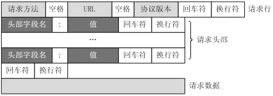

httpclient
========
直接发送 http 请求的客户端工具，有图形界面也支持命令行。具体功能类似 idea 中的 httpclient。

- 暂不支持文件上传，待开发

## 使用方式

### 安装

点击下载可执行文件：[httpclient]() 放置在任何你喜欢的位置。

**命令行**

```bash
httpclient -f <请求内容文件>
```

参数说明：

> 可通过 -h 参数查看命令行详细参数信息。

```
Usage of httpclient:
  -e string
        执行环境
  -f string
        文件路径，若 path 以 #[数字] 结尾(如:/a/b/c.txt#1)则表示只解析此文件中第[数字]个请求
  -h    显示帮助信息
  -i int
        请求片段，从 1 开始。优先级比 path 中 #[数字]优先级高 (default -1)
```

**图形界面**

> 待实现

双击 `httpclient`。


### 准备请求

- 新建文本文件

- 在文本文件中添加请求内容。

### 请求内容

请求内容按照 HTTP 协议格式编写：

 

> 同一个文件可以只写一个请求，也可以写多个请求。
>
> 编写多个请求默认按顺序全部执行。
>
> 若要执行文件中的某个请求，参见命令行说明。

#### 单请求

```
GET https://github.com/sudot/httpclient
```

支持自定义变量

```
GET https://{{host}}/sudot/httpclient
```

浏览器请求报文复制粘贴

```
GET /sudot/httpclient HTTP/1.1
Host: github.com
```

#### 多请求

> 多请求使用三个 # 符号来分隔每个请求
>
> 可参考项目中 data 目录下的文件

如下三个请求在同一个文件中

```
### 自定义变量
GET https://{{host}}/sudot/httpclient

### host 和 path 分开写
GET /sudot/httpclient
Host: github.com

### 支持变量
GET /sudot/httpclient HTTP/1.1
Host: {{host}}
```

#### 注释

支持双斜线注释 `//` 和 `#` 注释

> 不支持行尾注释。
>
> `//` 和 `#` 只能作为整行的第一个非空字符串出现，若写在行尾则视为此行的有效内容。

**错误的写法**

- 写在行尾

```
POST /users
Content-Type: application/json;UTF-8 // 写在这里是错误的，会当做 Content-Type 的值

{
  "name": "张三" # 写在这里是错误的，会当做 body 的值
}
```

- 写在原本应该有的换行上

```
POST /users
Content-Type: application/json;UTF-8
// 这样写是错的,因为此处应该有一个空行分隔请求头和请求体
{
  "name": "张三"
}
```

**正确的写法**

```
### 自定义变量，这是分隔符，也可以写注释
POST /users
# 这是注释，使用 json 的请求格式
// 这是注释，使用 json 的请求格式
Content-Type: application/json;UTF-8

{
  "name": "张三"
}
```

- 写在原本应该有的换行上

```
POST /users
Content-Type: application/json;UTF-8
# 这样写是对的，因为在请求头和请求体之间没有缺少应有的空行
// 这样写是对的，因为在请求头和请求体之间没有缺少应有的空行

{
  "name": "张三"
}
```

```
POST /users
Content-Type: application/json;UTF-8

# 这样写是对的，因为在请求头和请求体之间没有缺少应有的空行
// 这样写是对的，因为在请求头和请求体之间没有缺少应有的空行
{
  "name": "张三"
}
```

- 写在请求体中

```
POST /users
Content-Type: application/json;UTF-8

{
  # 这里也可以写注释
  // 这里也可以写注释
  "name": "张三"
}
```

### 自定义变量

#### 共享变量

文件名必须为 `http-client.env.json`，放置在与执行文件同级目录或任意子目录中。

#### 私有变量

文件名必须为 `http-client.private.env.json`，放置在与执行文件同级目录或任意子目录中。

> 若同一个变量同时存在与私有变量和共享变量中，私有变量中的值会覆盖共享变量中的值。

两种类型的变量文件应该分别只有一个，处理时扫描到一个则不在继续扫描同类型变量文件。